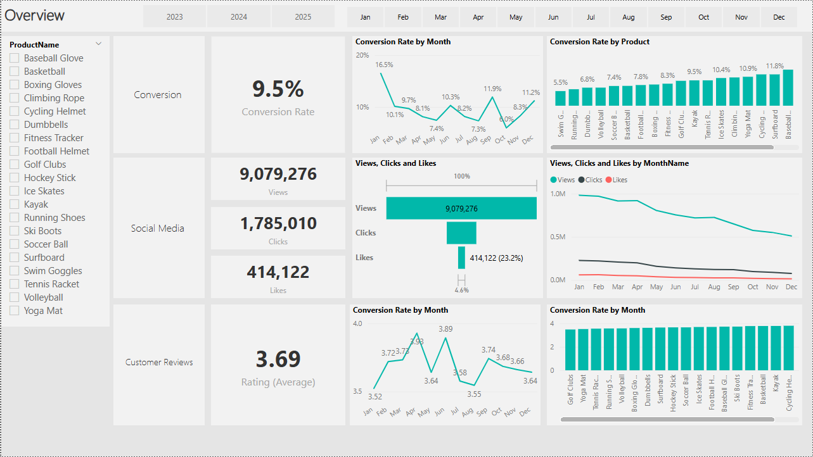
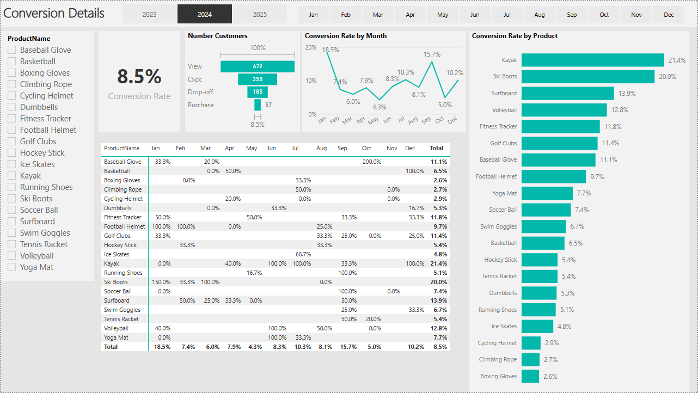
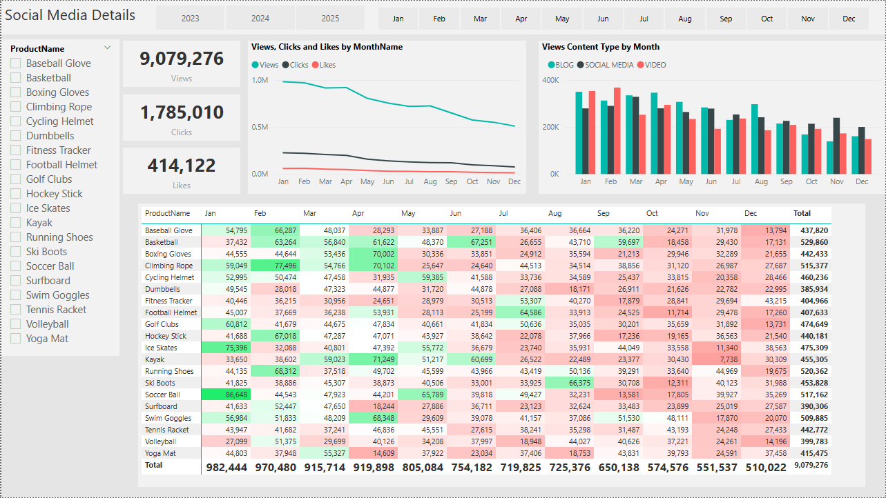
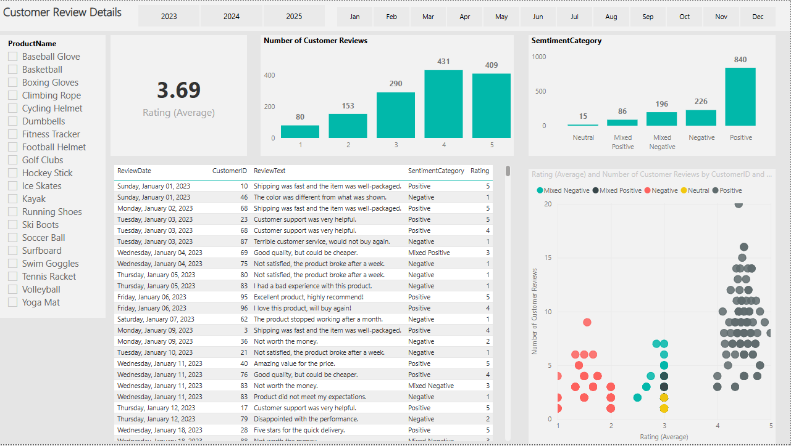
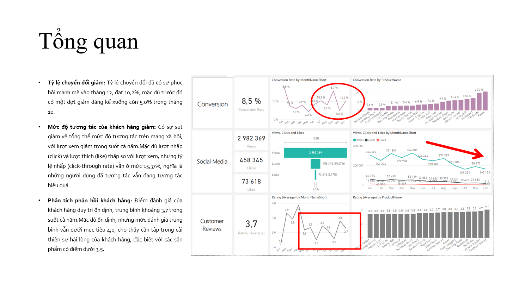
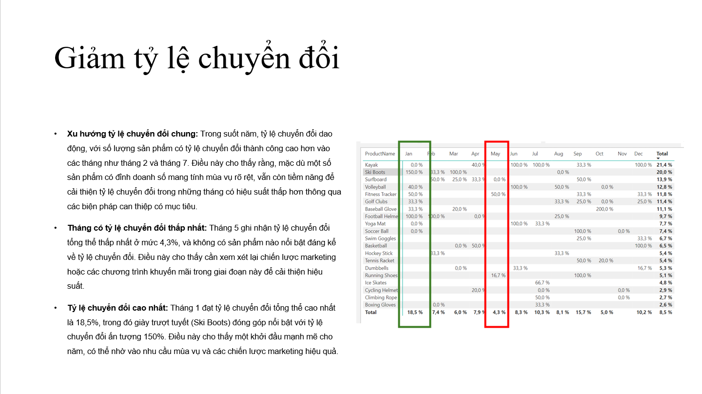
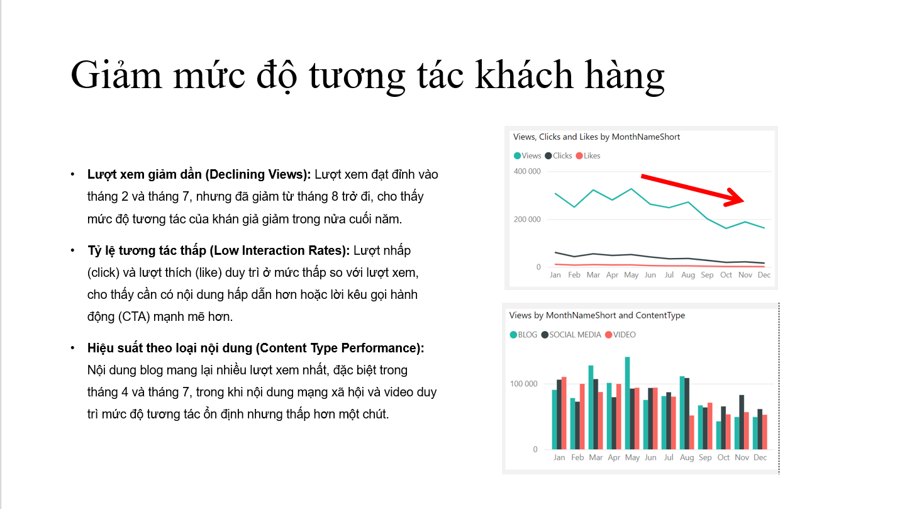
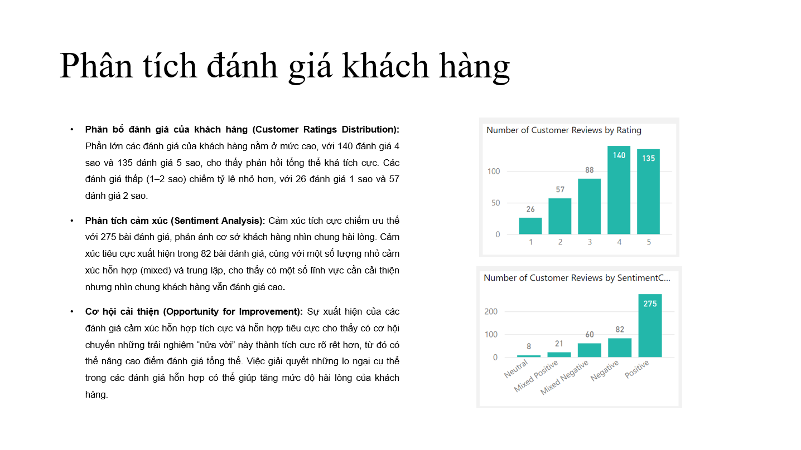

# SQL_Marketing-Analyist_Project

## Giới thiệu về vấn đề doanh nghiệp

ShopEasy, một doanh nghiệp bán lẻ trực tuyến, đang đối mặt với tình trạng giảm mức độ tương tác của khách hàng và tỷ lệ chuyển đổi thấp, mặc dù đã triển khai nhiều chiến dịch tiếp thị trực tuyến mới. Họ đang tìm đến bạn để thực hiện một phân tích chi tiết và xác định những lĩnh vực cần cải thiện trong chiến lược tiếp thị của họ.

### Các ý chính 

+ **Giảm mức độ tương tác của khách hàng**: Số lượng khách hàng tương tác và gắn kết với trang web cũng như nội dung marketing đã giảm.

+ **Tỷ lệ chuyển đổi giảm:** Ngày càng ít khách truy cập trang web trở thành khách hàng trả tiền.

+ **Chi phí marketing cao:** Đã đầu tư đáng kể cho các chiến dịch marketing nhưng không mang lại lợi nhuận như kỳ vọng.

+ **Cần phân tích phản hồi của khách hàng:** Việc hiểu rõ ý kiến khách hàng về sản phẩm và dịch vụ là rất quan trọng để cải thiện mức độ tương tác và tỷ lệ chuyển đổi.

### Mục tiêu 

**Tăng tỷ lệ chuyển đổi**:

 + Mục tiêu: Xác định các yếu tố ảnh hưởng đến tỷ lệ chuyển đổi và đưa ra khuyến nghị để cải thiện.

 + Phân tích: Nêu bật các giai đoạn quan trọng nơi khách truy cập rời bỏ (drop-off) và đề xuất cải tiến để tối ưu hóa kênh chuyển đổi (conversion funnel).

**Tăng cường mức độ tương tác của khách hàng**:

 + Mục tiêu: Xác định loại nội dung nào tạo ra mức độ tương tác cao nhất.

 + Phân tích: Đánh giá mức độ tương tác với các loại nội dung marketing khác nhau để xây dựng chiến lược nội dung hiệu quả hơn.

**Cải thiện điểm số phản hồi khách hàng**:

 + Mục tiêu: Hiểu các chủ đề thường xuất hiện trong đánh giá của khách hàng và cung cấp thông tin có thể hành động.

 + Phân tích: Xác định những phản hồi tích cực và tiêu cực lặp lại để định hướng cải thiện sản phẩm và dịch vụ.

### Các bước thực hiện 

 + Xử lý, làm sạch dữ liệu bằng SQL
   
   + Làm sạch vấn đề khoảng trắng trong cột ReviewText

```sql
SELECT 
    ReviewID,   
    CustomerID, 
    ProductID,  
    ReviewDate, 
    Rating,     
   
    REPLACE(ReviewText, '  ', ' ') AS ReviewText
   
FROM 
    dbo.customer_reviews
```
   + Làm sạch và chuẩn hóa bảng engagement_data
   
```sql
SELECT 
    EngagementID,  
    ContentID,  
	CampaignID,  
    ProductID, 
    UPPER(REPLACE(ContentType, 'Socialmedia', 'Social Media')) AS ContentType,  
    LEFT(ViewsClicksCombined, CHARINDEX('-', ViewsClicksCombined) - 1) AS Views,  
    RIGHT(ViewsClicksCombined, LEN(ViewsClicksCombined) - CHARINDEX('-', ViewsClicksCombined)) AS Clicks,  
    Likes,  
    
    FORMAT(CONVERT(DATE, EngagementDate), 'dd.MM.yyyy') AS EngagementDate  
FROM 
    dbo.engagement_data  
WHERE 
    ContentType != 'Newsletter'
```
  + Common Table Expression (CTE) để xác định và gắn nhãn các bản ghi trùng lặp
```sql
WITH DuplicateRecords AS (
    SELECT 
        JourneyID,  
        CustomerID,  
        ProductID,  
        VisitDate,  
        Stage,  
        Action,  
        Duration,  
        
        ROW_NUMBER() OVER ( PARTITION BY CustomerID, ProductID, VisitDate, Stage, Action,  ORDER BY JourneyID  ) AS row_num  
    FROM 
        dbo.customer_journey  
) 
SELECT *
FROM DuplicateRecords
-- WHERE row_num > 1  
ORDER BY JourneyID   
SELECT 
    JourneyID, 
    CustomerID,  
    ProductID, 
    VisitDate, 
    Stage,  
    Action, 
    COALESCE(Duration, avg_duration) AS Duration  
FROM 
    (  SELECT 
            JourneyID,  
            CustomerID, 
            ProductID,  
            VisitDate,  
            UPPER(Stage) AS Stage,  
            Action,
            Duration,  
            AVG(Duration) OVER (PARTITION BY VisitDate) AS avg_duration,  
            ROW_NUMBER() OVER ( PARTITION BY CustomerID, ProductID, VisitDate, UPPER(Stage), Action ORDER BY JourneyID  ) AS row_num  
        FROM 
            dbo.customer_journey  
    ) AS subquery  
WHERE 
    row_num = 1;  
```
 + Phân tích nâng cao về Cảm xúc bằng Python
  ```sql
import pandas as pd
import pyodbc
import nltk
from nltk.sentiment.vader import SentimentIntensityAnalyzer

nltk.download('vader_lexicon')

def fetch_data_from_sql():
    # Define the connection string with parameters for the database connection
    conn_str = (
        "Driver={SQL Server};"  # Specify the driver for SQL Server
        "Server=ALI-LT2024\\SQLEXPRESS;"  # Specify your SQL Server instance
        "Database=PortfolioProject_MarketingAnalytics;"  # Specify the database name
        "Trusted_Connection=yes;"  # Use Windows Authentication for the connection
    )
    conn = pyodbc.connect(conn_str)
    query = "SELECT ReviewID, CustomerID, ProductID, ReviewDate, Rating, ReviewText FROM fact_customer_reviews"
    df = pd.read_sql(query, conn)
    conn.close()
    return df
customer_reviews_df = fetch_data_from_sql()
sia = SentimentIntensityAnalyzer()

def calculate_sentiment(review):
    sentiment = sia.polarity_scores(review)
    return sentiment['compound']
def categorize_sentiment(score, rating):

    if score > 0.05:  
        if rating >= 4:
            return 'Positive'  
        elif rating == 3:
            return 'Mixed Positive'  
        else:
            return 'Mixed Negative' 
    elif score < -0.05:  
        if rating <= 2:
            return 'Negative'  
        elif rating == 3:
            return 'Mixed Negative'  
        else:
            return 'Mixed Positive'  
    else:  # Neutral sentiment score
        if rating >= 4:
            return 'Positive'  
        elif rating <= 2:
            return 'Negative'  
        else:
            return 'Neutral' 
def sentiment_bucket(score):
    if score >= 0.5:
        return '0.5 to 1.0'  
    elif 0.0 <= score < 0.5:
        return '0.0 to 0.49'  
    elif -0.5 <= score < 0.0:
        return '-0.49 to 0.0'  
    else:
        return '-1.0 to -0.5'  

customer_reviews_df['SentimentScore'] = customer_reviews_df['ReviewText'].apply(calculate_sentiment)

customer_reviews_df['SentimentCategory'] = customer_reviews_df.apply(
    lambda row: categorize_sentiment(row['SentimentScore'], row['Rating']), axis=1)

customer_reviews_df['SentimentBucket'] = customer_reviews_df['SentimentScore'].apply(sentiment_bucket)

print(customer_reviews_df.head())

customer_reviews_df.to_csv('fact_customer_reviews_with_sentiment.csv', index=False)
```

 + Xây dựng Dashboard bằng công cụ Power BI

   + Overviews



   + Conversion Details
     


   + Social Media Details
     


  + Customer Review Details
     


 + Trình bày, đưa ra đề xuất
   









